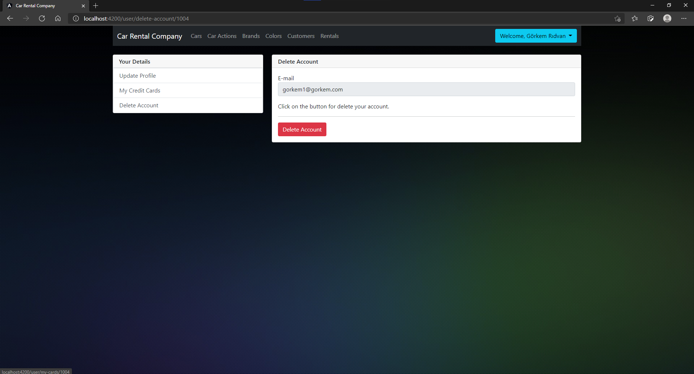

# CarRentalNg  

(Scroll down for images.)

Mar 24, 2021  
  
- Dark theme in action.  
- Login / Register properties added.  
- Findex-score system added.  
- Customers whose findex score is less than the minimum findex score of the vehicle cannot rent a car.  
- Customers who reach the 1900 findex record become VIP customers.  
- The names of the logged-in users are written on the navbar, for non-logged in users there will be login / register buttons on the navbar.  
- Login is required to rent a car.  
- Users can view and update their information. (First Name, Last Name, E-mail, Password, Credit-Cards, Delete Account)  
- Users have the option to save their credit card for subsequent purchases.  
- It is not allowed to rent a car within the date range rented by someone else.  
- Successful paying users earn 100 findex points.  

This project was generated with [Angular CLI](https://github.com/angular/angular-cli) version 11.2.3.

## Development server

Run `ng serve` for a dev server. Navigate to `http://localhost:4200/`. The app will automatically reload if you change any of the source files.

## Code scaffolding

Run `ng generate component component-name` to generate a new component. You can also use `ng generate directive|pipe|service|class|guard|interface|enum|module`.

## Build

Run `ng build` to build the project. The build artifacts will be stored in the `dist/` directory. Use the `--prod` flag for a production build.

## Running unit tests

Run `ng test` to execute the unit tests via [Karma](https://karma-runner.github.io).

## Running end-to-end tests

Run `ng e2e` to execute the end-to-end tests via [Protractor](http://www.protractortest.org/).

## Further help

To get more help on the Angular CLI use `ng help` or go check out the [Angular CLI Overview and Command Reference](https://angular.io/cli) page.
